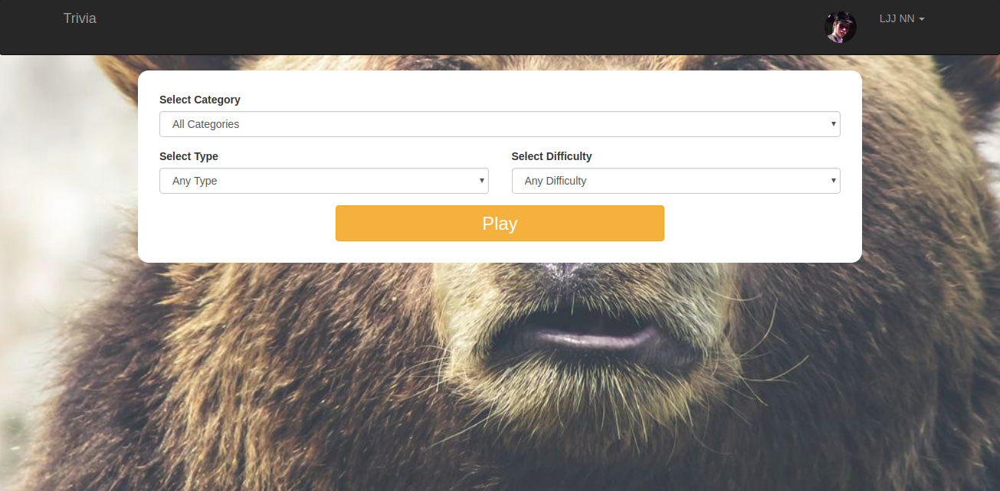
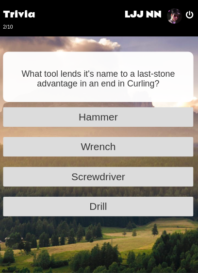
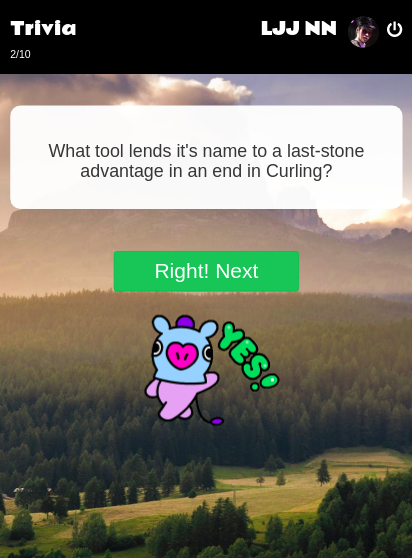
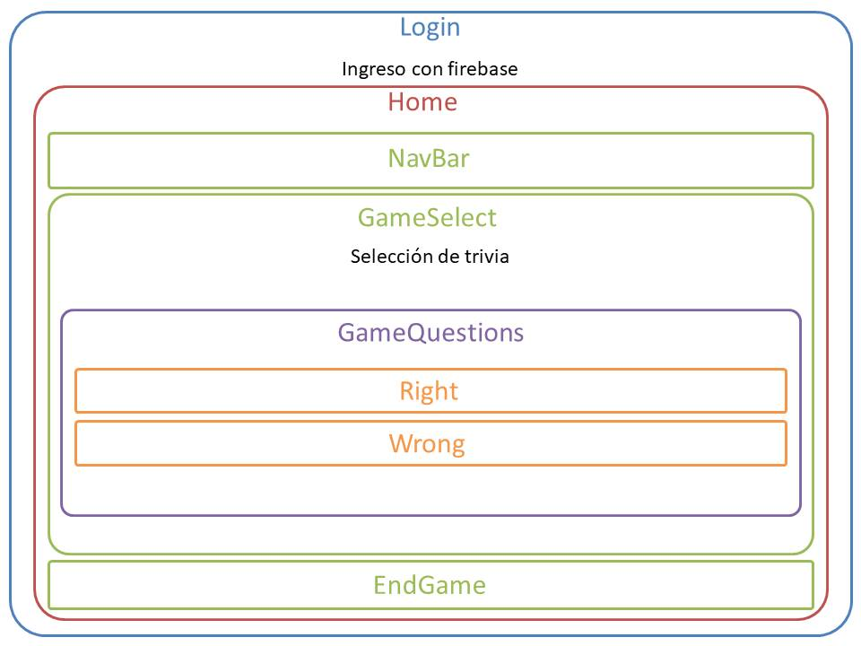

# Trivia



 

Trivia game questions by category, type and difficulty.

## Hosting

[Firebase](https://react-trivia.firebaseapp.com/)

[GH-PAGES](https://bimiriya.github.io/react-trivia/)

## Development

Made with React and the Open Trivia Database.

### React

This library was used for component creation and its virtual DOM characteristics.

```
npm install react
```
```
npm install react-dom
```

## Tech requirements

The project was developed with the following dependencies
+ Dev dependencies
   - GH-PAGES `^1.1.0`

+Product dependencies
   -Firebase `^4.11.0`
   - React `^16.2.0`
   - React-DOM `^16.2.0`
   - React Bootstrap `^0.32.1`
   - React-gif-player `^0.3.1`
   - React Scripts `1.1.1`

## Wireframe



## Authors

* **Irene Rodriguez** - [IreeRodriguez](https://github.com/IreeRodriguez)
* **Almendra Oyarzún** - [bimiriya](https://github.com/bimiriya)


## License

This project is licensed under the MIT License - see the [LICENSE.md](LICENSE.md) file for details
